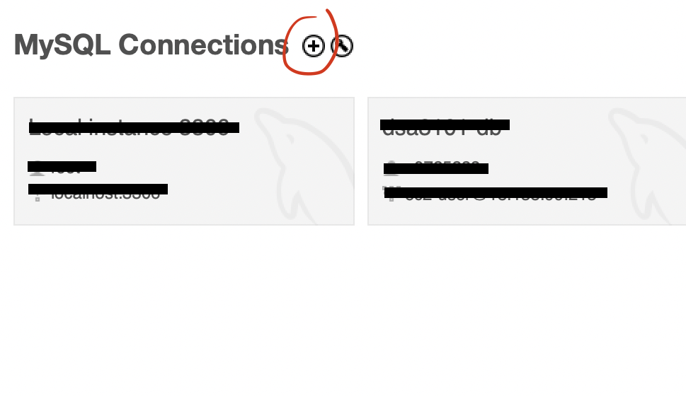
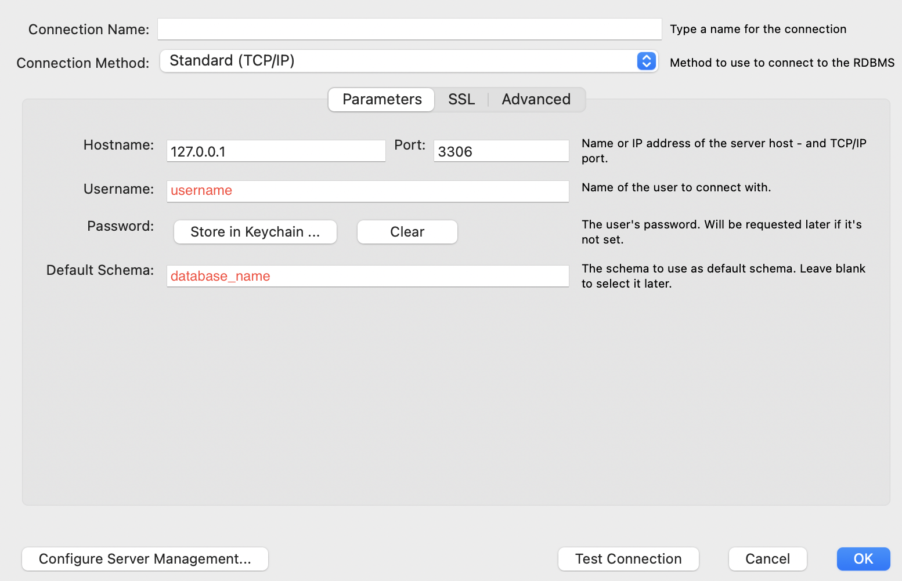
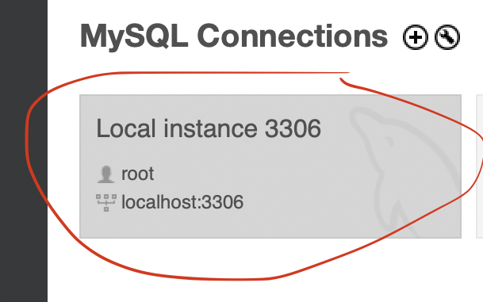

<!-- PROJECT SHIELDS -->
![Unit Tests][testing-shield]
<a name="readme-top"></a>

<!-- ABOUT THE PROJECT -->
## About The Project

The Student Recreation Center (SRC) is a bustling hub frequented for various activities, including exams, sporting events, and campus life activities. However, it has been temporarily closed for construction work related to the upcoming NUS student athlete dormitory. In light of this closure of SRC and its existing carpark (CP5), the nearby carparks such as Raffles Hall (CP4) and University Cultural Centre (CP3) have to compensate for this change. Failure to make adequate preparations for such closures could result in neighbouring carparks being overwhelmed, leaving drivers struggling to find parking on campus.

To address this issue, we aim to develop an interactive simulation model for UCI in the form of a webapp. This simulation will have the capability to mimic various parking events, such as reducing the availability of red/white lots at a specific carpark or closing down certain carparks. With this simulation tool, UCI will be better equipped to plan for potential disruptions in the future, ensuring that they can manage parking resources effectively when such events occur.

This project is part of our graded coursework in the National University of Singapore module DSA3101: Data Science in Practice.

<!-- GETTING STARTED -->
## Getting Started

### Prerequisites

_Ensure that you have done/are doing all these installations based on your current operating system._
1. Ensure that you have python installed. You may do so [here](https://www.python.org/downloads/). 
2. Install pip [here](https://pip.pypa.io/en/stable/installation/).
3. Intall MySQLWorkbench [here](https://dev.mysql.com/downloads/workbench/).

### Setting up MySQLWorkbench

1. Setup a new MySQL Connection by clicking on the + icon.


2. Fill in all the compulsory fileds. In the case of our webapp, it is important to remember the fields `Username`, `Password` and `Default Schema` that we set. **ENSURE** that you have set the port to 3306, else it will not run.


3. Press ok. 

### Installation

1. Clone the repo.

   ```sh
   git clone https://github.com/sunroofgod/dsa3101-2310-14-carpark.git
   ```
2. Download all the required dependencies.
   ```sh
   pip install -r requirements.txt
   ```
3. Set up environment variables. You may do so with your favourite text editor. In this case, we are using vim.
   ```sh
   vim .env # ensure you are in the root directory of the cloned repo
   ```
   Make sure you have these three variables declared in .env in accordance to the way you have setup your MySQLWorkbench database.
   ```txt
   DATABASE_NAME=<your schema name>
   MYSQL_USERNAME=<your mysqsl username>
   MYSQL_PASSWORD=<your mysqsl password>
   
   # replace the details within the angle brackets with your details.
   # don't forget to delete the angle brackets as well.
   ```
4. Make sure you have started running a MySQL Connection instance. You may do so by clicking on the MySQL Connection you have previously set up as seen here.


5. Startup the flask backend.
   ```sh
   cd backend # if you were originally in the root directory of the cloned repo
   flask --app app run
   ```
   
<!-- BOTTOM BANNER -->
This Full-stack project is built entirely (with love) in

[![Flask][Flask]][Flask-url] 
[![Python][Python]][Python-url] 

<p align="right">(<a href="#readme-top">back to top</a>)</p>

<!-- MARKDOWN LINKS & IMAGES -->
[testing-shield]: https://img.shields.io/badge/unit_tests-passing-green
[Flask]: https://img.shields.io/badge/Flask-000000?style=for-the-badge&logo=flask&logoColor=white
[Flask-url]: http://flask.palletsprojects.com
[Python]: https://img.shields.io/badge/Python-3776AB?style=for-the-badge&logo=python&logoColor=white
[Python-url]: https://www.python.org
