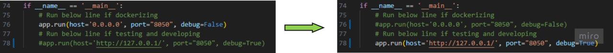
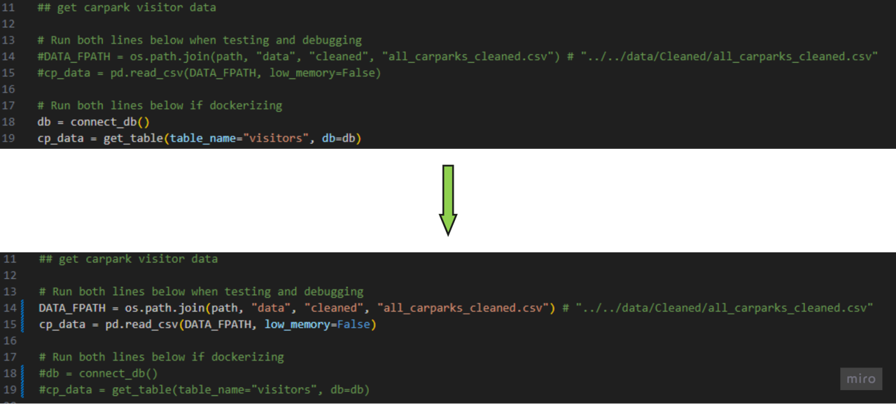
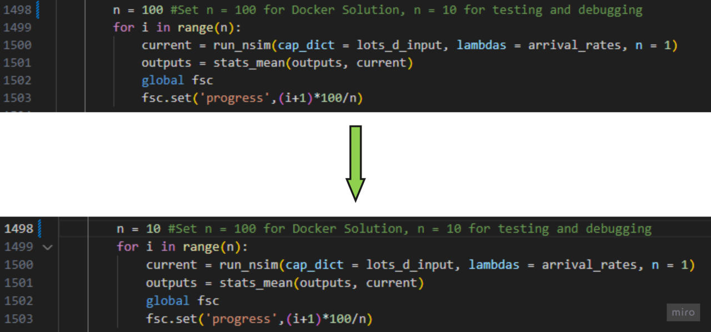

<!-- PROJECT SHIELDS -->
![Unit Tests][testing-shield]
<a name="readme-top"></a>

<!-- ABOUT THE PROJECT -->
## About The Project

The Student Recreation Center (SRC) is a bustling hub frequented for various activities, including exams, sporting events, and campus life activities. However, it has been temporarily closed for construction work related to the upcoming NUS student athlete dormitory. In light of this closure of SRC and its existing carpark (CP5), the nearby carparks such as Raffles Hall (CP4) and University Cultural Centre (CP3) have to compensate for this change. Failure to make adequate preparations for such closures could result in neighbouring carparks being overwhelmed, leaving drivers struggling to find parking on campus.

To address this issue, we aim to develop an interactive simulation model for UCI in the form of a webapp. This simulation will have the capability to mimic various parking events, such as reducing the availability of red/white lots at a specific carpark or closing down certain carparks. With this simulation tool, UCI will be better equipped to plan for potential disruptions in the future, ensuring that they can manage parking resources effectively when such events occur.

This project is part of our graded coursework in the National University of Singapore module DSA3101: Data Science in Practice.

## Getting Started
1. Clone the repo.

   ```sh
   git clone https://github.com/sunroofgod/dsa3101-2310-14-carpark.git
   ```
2. Create a folder in the root of the cloned repo 'data'
3. Download data from [here](https://nusu.sharepoint.com/:u:/r/sites/Section_2310_1390/Shared%20Documents/General/Video%20Submissions/14-carpark/data.zip?csf=1&web=1&e=Z7FBX4)
4. Extract contents of the downloaded zip into the 'data' folder

## Running Our Application (Docker Solution)
1. Proceed to root of cloned local repository and dockerize Application
    ```sh
   docker compose up -d
   ```
2. Wait for containers to be set up
3. Proceed to our Application Site at [https://localhost:8050/](https://localhost:8050/).

## Running Our Application (Testing and Debugging)
1. Checkout a new branch from master
   
    ```sh
   git checkout -b <branch-name>
   ```
2. Modify Lines 74-78 of frontend/app.py


3. Modify Lines 11-19 of backend/des/params.py


4. Modify Line 1498 of frontend/pages/params.py


5. Change working directory to root of repository  
6. Install Required Packages

   ```sh
   pip install requirements.txt
   ```
7. Run Application for testing and debugging with command
   
    ```sh
   python frontend/app.py
   ```
8. Proceed to our Application Site at [https://localhost:8050/](https://localhost:8050/).     
9. After modifications, revert changes in Steps 2-4   

<!-- BOTTOM BANNER -->
This Full-stack project is built entirely (with love) in

[![Dash][Dash]][Dash-url] 
[![Python][Python]][Python-url] 

<p align="right">(<a href="#readme-top">back to top</a>)</p>

<!-- MARKDOWN LINKS & IMAGES -->
[testing-shield]: https://img.shields.io/badge/unit_tests-passing-green
[Dash]: https://img.shields.io/badge/Plotly-%233F4F75.svg?style=for-the-badge&logo=plotly&logoColor=white
[Dash-url]: https://dash.plotly.com/
[Flask]: https://img.shields.io/badge/Flask-000000?style=for-the-badge&logo=flask&logoColor=white
[Flask-url]: http://flask.palletsprojects.com
[Python]: https://img.shields.io/badge/Python-3776AB?style=for-the-badge&logo=python&logoColor=white
[Python-url]: https://www.python.org


